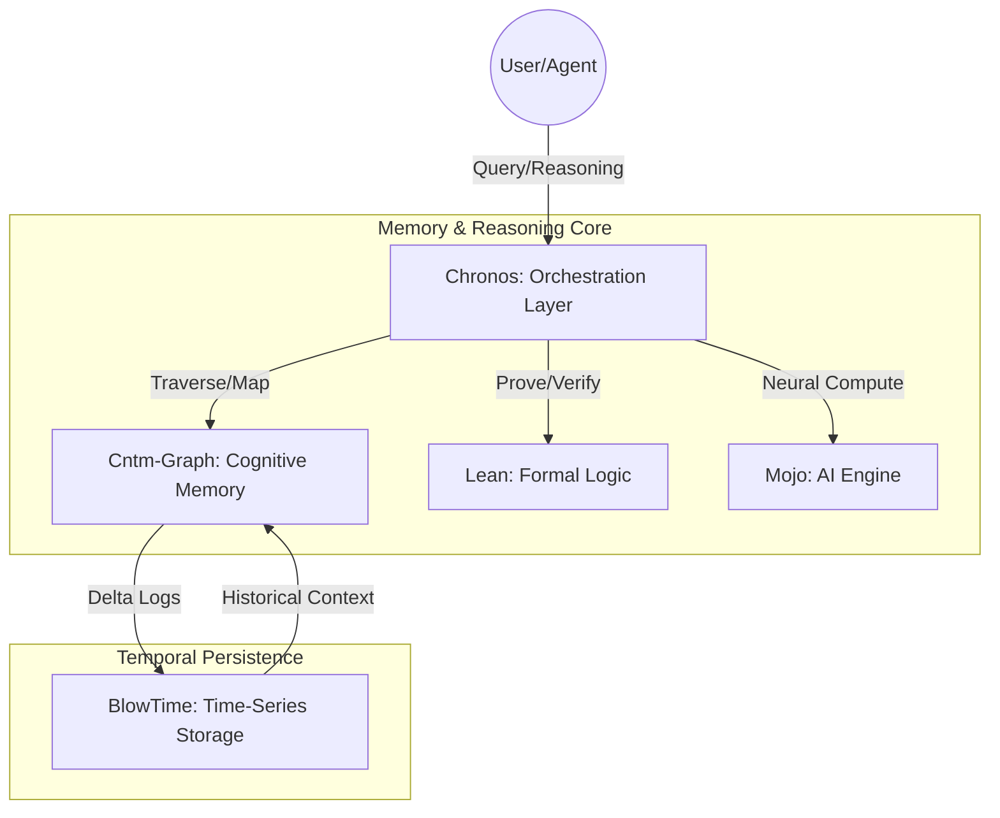

# 🏛 Architecture: Chronos - The Graph-based AI Cognition Layer

## 🎯 High-Level Vision
Chronos serves as the **Standard Memory for AGI**, bridging the gap between symbolic reasoning and neural processing. It provides AI with a brain-like memory layer that is both persistent (via BlowTime) and logically verifiable (via Lean).

## 🧬 System Architecture

## 🛠 Tech Stack & Integration
- **Core Engine:** Rust (Axum) for high-concurrency orchestration.
- **Cognitive Graph:** Cntm-Graph (Custom Engine) for zero-copy memory mapping.
- **Temporal Layer:** BlowTime (Custom Engine) for high-throughput time-series delta storage.
- **AI/Neural:** Mojo (PyTorch/CUDA via Modular) for predictive cognitive modeling.
- **Formal Logic:** Lean Proof Assistant for verifying graph accuracy and security protocols.

## 🔐 Security Posture: High (Mission Critical)
- **Zero-trust architecture** for all internal service communication.
- **End-to-End Encryption (E2EE)** for all graph data persistence.
- **Formal Verification** of security protocols using Lean to ensure zero logical vulnerabilities.
- **Hardware-level isolation** for Mojo/CUDA compute workloads.
